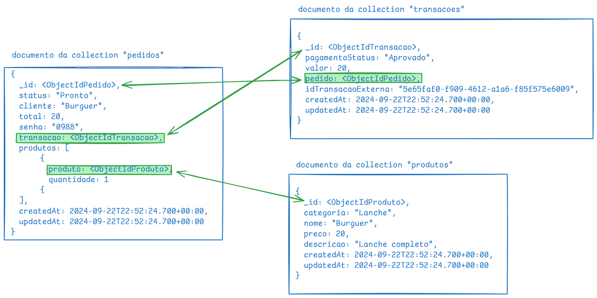

# Clean Arch Lanchonete
Projeto do curso de pós graduação da FIAP

## Requisitos para deploy
- Banco de dados em produção
- Cluster EKS em produção

## Secrets
Secrets cadastradas no repositório do GitHub

```bash
AWS_REGION
AWS_ACCESS_KEY_ID
AWS_SECRET_ACCESS_KEY
AWS_SESSION_TOKEN
MONGODB_URL
DOCKERHUB_TOKEN
```

## Desenho da modelagem banco de dados



## Como rodar o projeto local?
### Docker compose
- Para iniciar
```bash
docker compose up
```
- Para encerrar
```bash
docker compose down
```

## Swagger
http://localhost:3000/documentation

